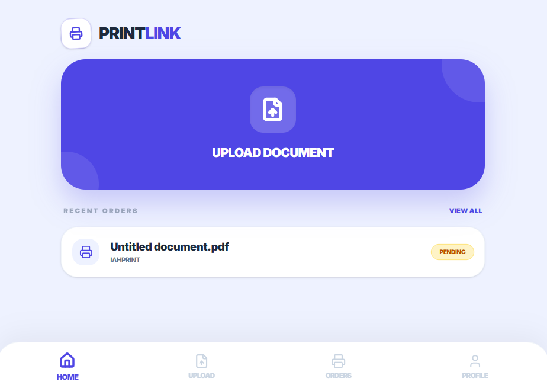
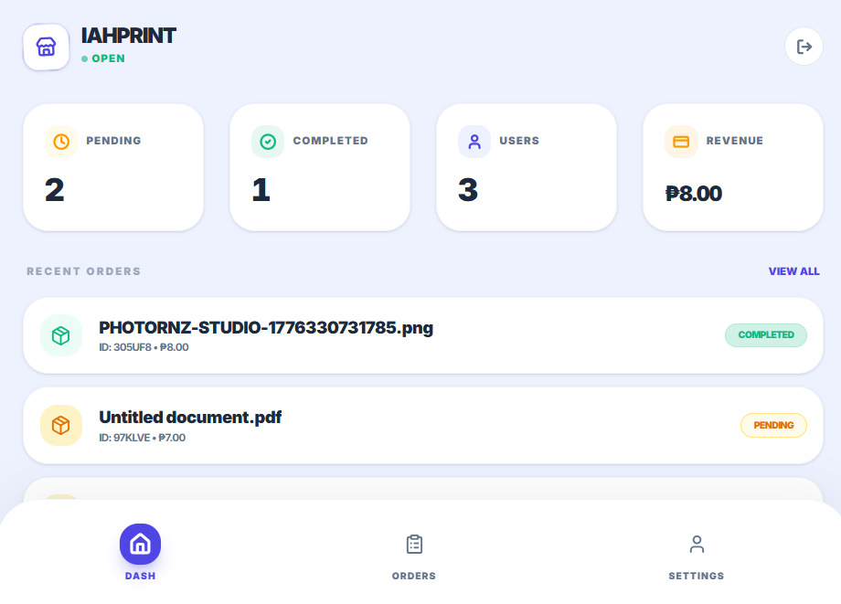
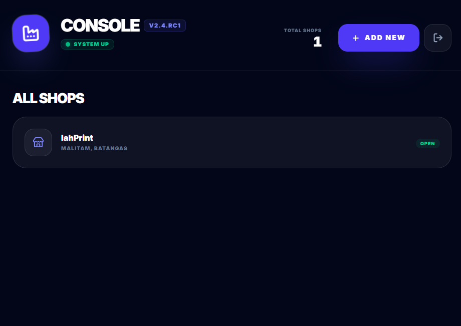

# 🖨️ PrintLink - Online Printing Platform

[](https://theprintlink.netlify.app)

**PrintLink** is a web application that connects users to nearby print shops.
It allows customers to upload documents, configure print settings, and track orders in a simple and convenient way.

---

## 🌟 Features

* User authentication (Google / Email)
* Browse nearby print shops
* Upload documents (PDF, etc.)
* Configure print settings (copies, color, paper size)
* Submit and track print orders
* Shop owner dashboard for managing orders
* Admin panel for monitoring the system

---

## 📸 Screenshots

### 👤 User Interface



### 🏪 Shop Owner Interface



### 🛠️ Admin Dashboard



---

## 🚀 Live Demo

🔗 https://theprintlink.netlify.app

✨ Deployed using Netlify

---

## 🛠 Technologies Used

* HTML
* CSS
* JavaScript
* Google Authentication
* Netlify

---

## 📂 Installation (Optional)

1. Clone the repo:

   ```bash
   git clone https://github.com/your-username/printlink.git
   ```

2. Open the project:

   ```
   index.html
   ```

---

## 📜 License

This project is for educational and portfolio purposes.
